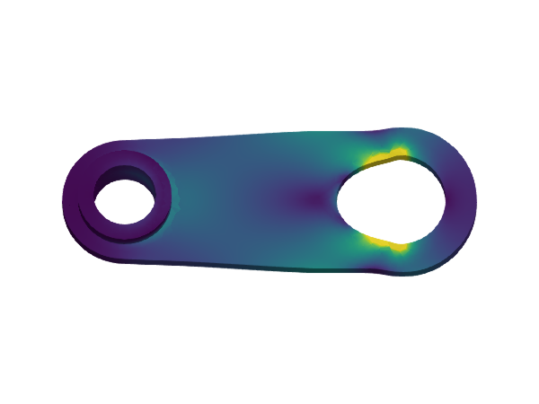
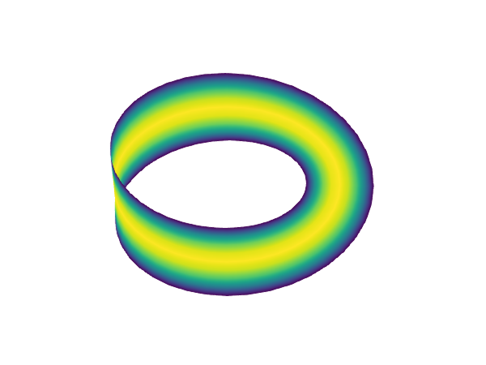

# Examples

|  |   |  |
|---|---|---|
| [Hello, World!](@ref) | [Interior penalty](@ref) | [Lagrange multipliers](@ref) |
|  |   |    |
| [Poisson equation](@ref) |  [p-Laplacian](@ref) | [Linear elasticity](@ref) |
|   |   |   |
| [Stokes lid-driven cavity](@ref) |  [Transient heat equation](@ref) | [Laplace-Beltrami](@ref) |

