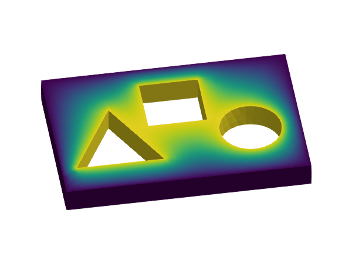
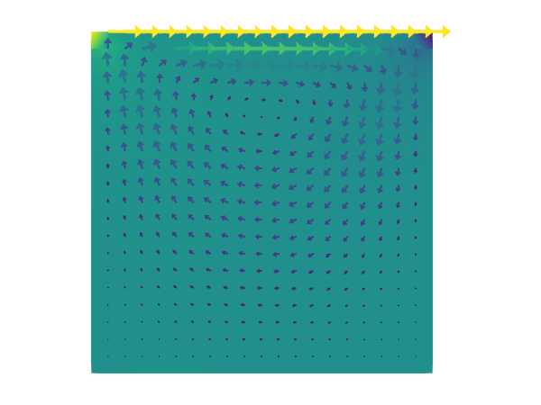

```@meta
CurrentModule = GalerkinToolkit
```

# Home

Welcome to the documentation page of GalerkinToolkit!

## Contents

- **[Home](@ref)** -- This page.
- **[Manual](@ref)** -- The user and developer guide. It gives the detailed explanations on how to use and extend the library.
- **[Examples](@ref)** -- They provide a quick overview of the main functionality of the library.
- **[Tutorials](@ref)** -- Learning material to get familiar with the building blocks of the library and the basics of the FEM. They are useful even if you are FEM expert as they walk you through the library step by step.
- **[API](@ref)** -- All the docstrings are here.

NB. This documentation is organized based on the [Diátaxis model](https://diataxis.fr/).

## Overview

### What


GalerkinToolkit is a high-performance finite element (FE) toolbox fully implemented in the [Julia programming language](https://julialang.org/). It provides modular building blocks to easily implement custom finite element codes to solve partial differential equations (PDEs), using a variety of numerical schemes, and across diverse computing environments.  GalerkinToolkit integrates seamlessly with the broader Julia ecosystem. It supports external solvers such as [`PartitionedSolvers.jl`](https://github.com/PartitionedArrays/PartitionedArrays.jl), [`PetscCall.jl`](https://github.com/PartitionedArrays/PetscCall.jl), [`LinearSolve.jl`](https://github.com/SciML/LinearSolve.jl), [`NonLinearSolve.jl`](https://github.com/SciML/NonlinearSolve.jl), and [`DifferentialEquations.jl`](https://github.com/SciML/DifferentialEquations.jl) to handle the algebraic systems resulting from PDE discretizations. For visualization, the toolkit provides plotting recipes for [`Makie.jl`](https://github.com/MakieOrg/Makie.jl) and utilities for exporting results in [`VTK` format](https://vtk.org/) using [`WriteVTK.jl`](https://github.com/JuliaVTK/WriteVTK.jl).

### Why

GalerkinToolkit is definitively not the first FEM software project out there, but it has some unique features. This includes an unified API with high- and low-level abstractions, a deep integration with the Julia package ecosystem, a new form compiler, and  a redesign of the core ideas behind [Gridap](https://github.com/gridap/Gridap.jl).

Find more information about GalerkinToolkit's features and novelties in the [Introduction](@ref) of the manual.

### Code examples

|  |   |  |
|---|---|---|
| [Hello, World!](@ref) |  [Poisson equation](@ref)| [p-Laplacian](@ref) |
|   |   | |
| [Stokes lid-driven cavity](@ref) |  [Transient heat equation](@ref) | |


## How to start

 In the [Manual](@ref), you will find explanations about the software design and guides for users and developers.  Look into the [Examples](@ref) section for an overview of how to solve different types of PDEs with GalerkinToolkit. Learn how to use the library (and the basics of FEM) with the tutorials in the [Tutorials](@ref) section.

### Pre-requisites

You need to be fluent in Julia before using GalerkinToolkit. You can learn Julia using the learning materials in [julialang.org](https://julialang.org/) or the lecture notes in [https://www.francescverdugo.com/XM_40017/dev/](https://www.francescverdugo.com/XM_40017/dev/).

It is also required to be familiar with the basics of FE methods. The basics are explained in the [Tutorials](@ref) section. For more in depth introduction, you can use the following books:
  - C. Johnson [Johnson2009](@cite)
  - J. Whiteley [Whiteley2017](@cite)
  - S.C. Brenner and L. R. Scott [Brenner2007](@cite)


## Help and discussion

- You can open a new discussion to ask questions [here](https://github.com/GalerkinToolkit/GalerkinToolkit.jl/discussions).
- If you have found a bug, open an issue [here](https://github.com/GalerkinToolkit/GalerkinToolkit.jl/issues). Do not forget to include a (minimal) reproducer.

## How to cite

See the [`CITATION.cff`](https://github.com/GalerkinToolkit/GalerkinToolkit.jl/blob/main/CITATION.cff) file.

## Contributing

This package is under active development and there are several ways to contribute:

- by enhancing the documentation (e.g., fixing typos, enhancing doc strings, adding examples).
- by addressing one of the [issues waiting for help](https://github.com/GalerkinToolkit/GalerkinToolkit.jl/labels/help%20wanted).
- by adding more tests to increase the code coverage.
- by extending the current functionality. In this case, open a discussion [here](https://github.com/GalerkinToolkit/GalerkinToolkit.jl/discussions) to coordinate with the package maintainers before proposing significant changes.

Discuss with the package authors before working on any non-trivial contribution.

## Acknowledgments

Since July 2024, this package is being developed with support from the [Netherlands eScience Center](https://www.esciencecenter.nl/) under grant ID [NLESC.SS.2023.008](https://research-software-directory.org/projects/hp2sim).

## Affiliations

This project is maintained at the [Computer Science department](https://vu.nl/en/about-vu/faculties/faculty-of-science/departments/computer-science) of [Vrije Universiteit Amsterdam](https://vu.nl/nl).
