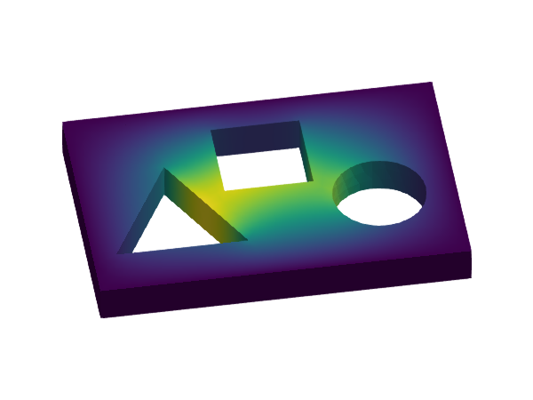
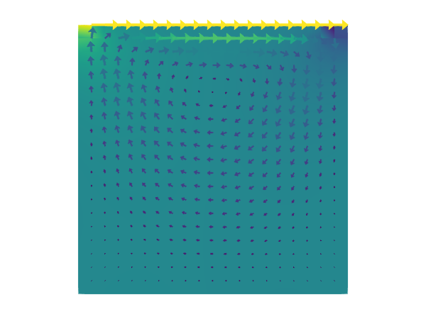

```@meta
CurrentModule = GalerkinToolkit
```

# Home

Welcome to the documentation page of GalerkinToolkit!

## Contents

- **[Home](@ref)** -- This page.
- **[Manual](@ref)** -- The user and developer guide. It gives the detailed explanations on how to use and extend the library.
- **[Examples](@ref)** -- They provide a quick overview of the main functionality of the library.
- **[Tutorials](@ref)** -- Learning material to get familiar with the building blocks of the library and the basics of the FEM. They are useful even if you are FEM expert as they walk you through the library step by step.
- **[API](@ref)** -- All the docstrings are here.

NB. This documentation is organized based on the [Diátaxis model](https://diataxis.fr/).

## Overview

### What

GalerkinToolkit is a high-performance finite element toolbox implemented in the [Julia programming language](https://julialang.org/).
It provides the building blocks for users to easily implement their own finite element computer codes to solve partial differential equations (PDEs).
GalerkinToolkit is fully implemented in Julia and inter operates with the Julia package ecosystem. It makes straight-forward to use external solvers from [`PartitionedSolvers.jl`](https://github.com/PartitionedArrays/PartitionedArrays.jl), [`PetscCall.jl`](https://github.com/PartitionedArrays/PetscCall.jl), [`LinearSolve.jl`](https://github.com/SciML/LinearSolve.jl), [`NonLinearSolve.jl`](https://github.com/SciML/NonlinearSolve.jl), and [`DifferentialEquations.jl`](https://github.com/SciML/DifferentialEquations.jl) to solve the algebraic systems you get after discretizing a PDE. For visualization, it defines recipes for [`Makie.jl`](https://github.com/MakieOrg/Makie.jl) and defines helper functions to save results with [`WriteVTK.jl`](https://github.com/JuliaVTK/WriteVTK.jl) in [`vtk` format](https://vtk.org/).

### Why

GalerkinToolkit is definitively not the first FEM software project out there, but it has some unique design features.
It combines the vision of frameworks like [FEniCS](https://fenicsproject.org/) and libraries like [Deal-ii](https://www.dealii.org/)
in a single package and accessible in a single programming language. Like FEniCS, it provides a high-level API close to the math notation and
a compiler of variational forms that automatically generates the finite element assembly loops. Like Deal-ii, it provides a highly customizable
low-level API allowing users to implement assembly loops by hand. Unlike any other package, it provides the building blocks to implement custom
 source-to-source compilers to generate code for numerical schemes working on computational grids.

### Code examples

|  |   |  |
|---|---|---|
| [Hello, World!](@ref) |  [Poisson equation](@ref)| [p-Laplacian](@ref) |
|   |   | |
| [Stokes lid-driven cavity](@ref) |  [Transient heat equation](@ref) | |


## How to start

 In the [Manual](@ref) section, you will find explanations about the software design and guides for users and developers.  Look into the [Examples](@ref) section for an overview of how to solve different types of PDEs with GalerkinToolkit. Learn how to use the library (and the basics of FEM) with the tutorials in the [Tutorials](@ref) section.

## Help and discussion

- You can open a new discussion to ask questions [here](https://github.com/GalerkinToolkit/GalerkinToolkit.jl/discussions).
- If you have found a bug, open an issue [here](https://github.com/GalerkinToolkit/GalerkinToolkit.jl/issues). Do not forget to include a (minimal) reproducer.

## How to cite

See the [`CITATION.cff`](https://github.com/GalerkinToolkit/GalerkinToolkit.jl/blob/main/CITATION.cff) file.

## Contributing

This package is under active development and there are several ways to contribute:

- by enhancing the documentation (e.g., fixing typos, enhancing doc strings, adding examples).
- by addressing one of the [issues waiting for help](https://github.com/GalerkinToolkit/GalerkinToolkit.jl/labels/help%20wanted).
- by adding more tests to increase the code coverage.
- by extending the current functionality. In this case, open a discussion [here](https://github.com/GalerkinToolkit/GalerkinToolkit.jl/discussions) to coordinate with the package maintainers before proposing significant changes.

Discuss with the package authors before working on any non-trivial contribution.

## Acknowledgments

Since July 2024, this package is being developed with support from the [Netherlands eScience Center](https://www.esciencecenter.nl/) under grant ID [NLESC.SS.2023.008](https://research-software-directory.org/projects/hp2sim).


